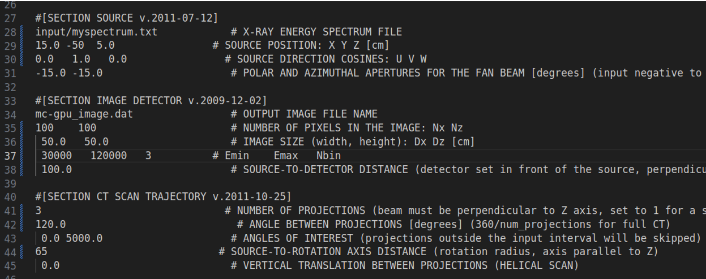
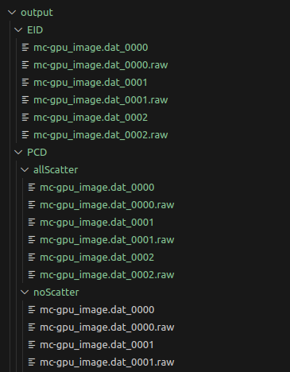
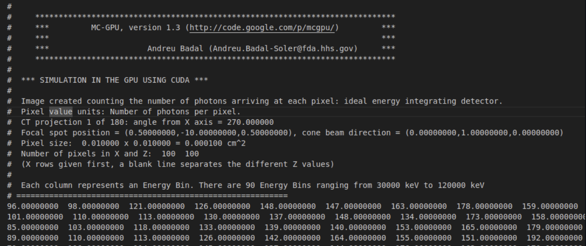

# Instruction Manual
Authors: Preetham Rudraraju, Yee Lam Elim Thompson, Bahaa Ghammraoui

## What is a Photon Counting Detector
A Photon Counting Detector is a specialized radiation detection device designed to keep track of each photon that hits a pixel within the detector's spatial boundaries. While an Energy Integrated Detector takes the aggregate energy deposited by all photons within a designated area, Photon Counting Detectors register and discern each photon and its energies. This capability facilitates the discrimination of varying energy levels among photons, thereby enabling spectral imaging.

The advantage of tracking individual photons lies in its capability to monitor and categorize each photon based on its specific energy level. This feature allows users to selectively concentrate on distinct energy ranges, facilitating the exclusion of extraneous data falling outside the scope of interest.

Due to their photon-counting capabilities, PCDs (Photon Counting Detectors) can produce high-resolution images with improved image contrast. Smaller detector pixels could enable improved spatial resolution and the elimination of down-weighting of lower energy photons.

#
## Changes to the code

The main modifications to the code from MC-GPU v1.3[1] involve enhancements to the tally_image function. This function now integrates the PCD functionality, in addition to changes in reading the input file and the structure of the output files. Specifically, the tally_image function integrates the PCD functionality by aggregating photon counts per pixel rather than energies. However, the function utilizes the energy of each photon before tallying to assign it to its corresponding Energy Bin.

For instance, with Emin set to 30 keV, Emax to 60 keV, and Nbin to 2, two energy bins are created: [30,45] and [45,60]. If a 50 keV photon is detected, it is categorized under the second Energy Bin [45,60].

In the read_input function, the goal is to extract a new line of parameters from the input file. This line includes three new parameters: Emin (minimum energy level to consider), Emax (maximum energy level of photons to consider), and Nbin (Number of Energy Bins to equally divide the user-defined energy range [Emin to Emax]). It's important to note that if Emin is set to a value less than 1, the simulation will use an Energy-Integrated detector instead of a Photon Counting Detector.

The output structure of the results has also been adjusted to facilitate the categorization of photon counts based on their energy levels. Energy Bins are computed by dividing the Energy Range (defined by Emin and Emax) into N (defined by Nbin) equal groups. Before counting the photon at each pixel in the tally_image function, photons are separated into their respective Energy Bins. To achieve this, the image object, which stores results for every projection simulation, had to adopt a three-dimensional structure.

#
## Input Parameters

Most of the parameters have essentially remained unchanged from the previous versions of MC-GPU except for three new additions. These new additions are highlighted in the image below.

<br>



<br>

These new parameters provide the simulation key variables to successfully run a Photon Counting Detector on MCGPU. The EMin and EMax define the minimum and maximum for the energy range that the user is interested in examining. As a result, a simulated photon that arrives at the detector consisting of energy outside of this user-defined will not be taken into account and excluded from the simulation results. Nbin stands for the number of energy bins. This variable defines how many equal groups the energy range be split into. 


#
## Output Structure
A New Image Structure was required to accept a simulation that is categorized by Energy Bins. A 3-D matrix configuration was adapted for the image object.

X -> Energy Bin <br>
Y -> Energy Interaction <br>
Z -> Pixel Number in the detector <br>

<p align="center">


The Figure below displays the output structure of results in the new Photon Counting Toolkit version. Unlike previously all the results will be located in an output folder. The location of the output folder can be modified by changing the output image file name parameter in the input file. 

<br>



<br>


The output folder consists of two subfolders EID and PCD. EID or Energy Integrated Detector subfolder will only receive results when an EID simulation is run (when Nbin < 1). Likewise, the PCD or Photon Counting detector subfolder will only receive results when a PCD simulation is run (when Nbin >= 1). The output results and binary output results in the EID option have remained unchanged from MCGPU v1.3 except for the fact that they are now located in the /[Image File Output Name]/Output/EID. Meanwhile, for PCD the structure of the output files themselves has changed. The Image below shows one of the projection output data files from the new PCD version.


<br>



Although each row still represents a pixel from the detector, the columns no longer represent one of the four types of photon interactions. Instead, each column now represents each energy bin in increasing order. This means the number of columns in thr PCD output files directly corresponds to the Nbin parameter that's defined. 

On the other hand, the columns no longer represent one of the four types of photon interactions. Instead, each column now represents each energy bin in increasing order. This means the number of columns in thr PCD output files directly corresponds to the Nbin parameter that's defined in input file.

Because the representation of the type of photon interaction data was removed from the output data, this was replaced with two subfolders within the PCD subfolder. We now have :

1. NonScatteredPhotons
2. allPhotons

The NonScatteredPhotons subfolder has the the phtoton counts at each pixel grouped in their respective energy bins for photons that did not encounter any sort of scattering interaction between the source and the detector (Non-Scattered). Meanwhile the allPhotons will include all photon counts; those that are Non-Scattered, have had a single Compton interaction, a single Rayleigh interaction, or a multi-scattered photon. For more information on the interactions data refer to the README.

<br>

</p>

#
## Running Sample
Before running the simulation please make sure you have all requirements to the run the MCGPU software. This sample walkthrough assumes you have a good understanding of running MCGPU v1.3. If you have any issues with the base requirements please go over the Installation and Compilation subsection of MCGPU v1.3[1] or contact us directly.

<br>

> [!NOTE]
> Please refer to the compilation section of the MCGPU v1.3 README for more information on compiling the code

<br>

In the Sample_Pencil_Beam folder, you will see the pencil_beam_simulation.in file which consists of the parameters along with the paths to phantom voxel file and material files. We will run this sample file from the home MC-GPU folder. First, we need to compile the MCGPU software and generate an executable. We can accomplish this by running 'make' in terminal located at the home MCGPU directory.

<br>

```
cd MCGPUv1.3_PCD
```

<br>

> [!WARNING]
> Both MCGPU v1.3 and MCGPU v1.3_PCD have only been tested in a Linux environment. If you are trying to run this on another environment you may run into a few issues. 

<br>

To compile with `Makefile`, use the command
```
make
```

To compile with `make_MC-GPU_v1.3_PCD.sh`, use the command
```
source make_MC-GPU_v1.3_PCD.sh
```

If successful, you will see an `MC-GPU_v1.3_PCD.x` file, which is the executable file for this tool.

Some of the common errors include ...
1. No helper_function: This function is located in the file "helper_cuda.h" which is typically in samples/common folder. Therefore, you will need to find where your samples/common path is located in your machine. For older version of cuda, the samples/common folder came with cuda installation. For cuda version 12.4+, you may need the  and modify the `Makefile` or `make_MC-GPU_v1.3_PCD.sh` to point to the Common folder in the cuda-samples toolkit by adding to the `nvcc` command with an additional path "-I/path/to/samples/common".

2. Missing "mpi.h" file: You would first need to install libopenmpi-dev via the command
```
sudo apt install libopenmpi-dev
```
If/when it is installed, you would need to add three flags to the `nvcc` command: `-DUSING_MPI`, `-lmpi`, and a path to the `mpi.h` file. To find the `mpi.h`, do
```
locate mpi.h
```
Copy and paste the path (not the file itself) into the `nvcc` command via `-I` flag. For example, for a path `/path/to/mpi.h`, the flag would be `-I/path/to`.

Please note that MCGPU runs without MPI library at the expanse of runtime. To completely turn off MPI, remove the flags `-DUSING_MPI` and `-lmpi`.

3. Even if the .x excutable is created, you may later run into pointer or memory errors. This may be due to an incorrect or missing gencode cababilities for your GPU model when doing the `nvcc` command in `Makefile` and/or `make_MC-GPU_v1.3_PCD.sh`. For older version of cuda, you would need to identify your GPU model via (e.g.) the `nvidia-smi` command and look up the correct cabability number for your model. For recent CUDA releases, `-arch=native` can be used instead of `-gencode=arch=compute_XX,code=sm_XX`, saving time to find the right gencode for your specific GPU model.

For `nvcc` example comments, please see `make_MC-GPU_v1.3_PCD.sh`.

<br>

This will generate an executable file `MC-GPU_v1.3_PCD.x` which we can now use to run the input file with the MC-GPU program. As an example, to run the `pencil_beam_simulation.in` file from the Sample_Pencil_Beam directory, you can run the following command line.

<br>

```
cd Sample_Pencil_Beam/
./../MC-GPU_v1.3_PCD.x pencil_beam_simulation.in | tee MC-GPU_v1.3.out
```

<br>

Now on the terminal, you will see the MCGPU application running the simulation. The current progress will be displayed as it will indicate which projection the program is currently simulating. Once finished the output file will be populated with the results of the simulations. The default path for the output file is set to inside the Sample folder, however, you can change this accordingly by adjusting the output file path parameter in the input file.


#
## Integrating the Photon Counting Toolkit with MCGPU to get Ideal PCD results

This version of MCGPU is capable of simulating a Photon Counting Detetor. However, this simulation is only capable of producing results from that of an ideal Phototon Counting Detector. For those who are interested in getting simulation results to that of a realistic Photon Counting Detector, we included scripts to facilitate the integration to the Johns Hopkins Photon Counting Toolkit (PcTK), developed by Ken Taguchi [2], on the MCGPU simulation output.

<br>

> [!NOTE]
> To run PcTK-MCGPU scripts you will be required to have the Photon Counting Toolkit software installed. For Installation of PctK, follow the instructions at https://pctk.jhu.edu/. The matlab scripts in PcTK_Integration/ folder are meant to be the plugs-in such that PcTK can read the MCGPU outputs.

<br>

Once you download the PcTK from Ken, copy or move the entire package into the PcTK_Integration/ folder.

<br>

> [!NOTE]
> The scripts we provided are currently only compatible with PcTK version 3.2.4. The scripts will be updated as new versions of PcTK become available if required.

<br>

For the first time you ever run PcTK, you must run `3_src/gen_nCovE.m` to generate spectral response as normalized energy-dependent covariance matrix for 3x3 neighboring pixels. For it to work with MCGPU outputs, we require four modifications to this script before running it. 

First is at L1 where the function `gen_nCovE()` is defined.
```
function    gen_nCovE
```
For this tool to work, we turned this function into a regular script such that it can access variables defined in previous steps/scripts.
```
%function    gen_nCovE
addpath( './3_src' );
```

Second is at L108 with the following code:
```
    % parameter file name
    filename_params  = [dirname_inputdata,'SRF_param_v32_20170622.csv']; 
```
The suffix numbers of the csv file may be different, but the file needs to be changed to `SRF_param.csv` to match the output filename defined in `prepare_detector.m`.
```
    % parameter file name
    %%%% Changes  %%%%%%%%%%%%%%%%%%%%%%%%%%%%%%%%%%%%%%%%%%%%%%%%
    %filename_params  = [dirname_inputdata,'SRF_param_v32_20170622.csv']; 
    filename_params  = [dirname_inputdata,'SRF_param.csv']; 
    %%%% Changes  %%%%%%%%%%%%%%%%%%%%%%%%%%%%%%%%%%%%%%%%%%%%%%%%
```

The third modification is around L142 with the following code:
```
% Create filenames for nCov3x3E and nCov3x3w using parameters
    if ~exist(dirname_outputdata,'dir')
        mkdir(dirname_outputdata);
    end
    % nCov3x3w
    filname_nCov3x3w = ...
        sprintf('dat_nCovw_ver%.1f_dpix_%d_dz_%d_r0_%d_esig_%.1f_Eth',...
        model_version, dpix, dz, r0, e_sig);
    for iEth=1:Nl
        filname_nCov3x3w = sprintf('%s_%.1f', filname_nCov3x3w, v_Eth(iEth));
    end
    filname_nCov3x3w = sprintf('%s_keV.mat',filname_nCov3x3w);
    filename_nCov3x3w = [dirname_outputdata,filname_nCov3x3w];  % for nCov3x3w file
```
This should be modified to ...
```
% Create filenames for nCov3x3E and nCov3x3w using parameters
    if ~exist(dirname_outputdata,'dir')
        mkdir(dirname_outputdata);
    end
    % nCov3x3w
    filname_nCov3x3w = ...
        sprintf('dat_nCovw_ver%.1f_dpix_%d_dz_%d_r0_%d_esig_%.1f_Eth',...
        model_version, dpix, dz, r0, e_sig);
    %%%% Changes  %%%%%%%%%%%%%%%%%%%%%%%%%%%%%%%%%%%%%%%%%%%%%%%%
    % for iEth=1:Nl
    %     filname_nCov3x3w = sprintf('%s_%.1f', filname_nCov3x3w, v_Eth(iEth));
    % end
    % filname_nCov3x3w = sprintf('%s_keV.mat',filname_nCov3x3w);
    filname_nCov3x3w = sprintf('%s.mat',filname_nCov3x3w);
    %%%% Changes  %%%%%%%%%%%%%%%%%%%%%%%%%%%%%%%%%%%%%%%%%%%%%%%%
    filename_nCov3x3w = [dirname_outputdata,filname_nCov3x3w];  % for nCov3x3w file
```

The last modification happens in L192:
```
%% (5) Generate nCovE data for 3x3 pixels
    t1 = clock;
    v_E = (1:1:170)'; 
    fprintf('\n');
    fprintf('nCov3x3pix: start time = %02d:%02d:%02.0f (hour:min:sec)\n', t1(4),t1(5),t1(6));
```
It should be changed to ...
```
%% (5) Generate nCovE data for 3x3 pixels
    t1 = clock;
    %%%% Changes  %%%%%%%%%%%%%%%%%%%%%%%%%%%%%%%%%%%%%%%%%%%%%%%%
    v_E = Ep;%(1:1:170)'; 
    %%%% Changes  %%%%%%%%%%%%%%%%%%%%%%%%%%%%%%%%%%%%%%%%%%%%%%%%
    fprintf('\n');
    fprintf('nCov3x3pix: start time = %02d:%02d:%02.0f (hour:min:sec)\n', t1(4),t1(5),t1(6));
```

Once the changes are applied, one can run the matlab code `generate_MCGPU_PENCILBEAM_SAMPLE.m` in MatLab interface under `PcTK_Integration/` folder. For the first time user, please make sure the `get_detector_response` variable (L7) is set to 1 such that it will create the covariance matrix for the detector parameters you provided. This will trigger the changes implemented in `gen_nCovE.m`.
```
>> cd PcTK_Integration/
>> generate_MCGPU_PENCILBEAM_SAMPLE
```
Before running `generate_MCGPU_PENCILBEAM_SAMPLE.m`, it is assumed that there are MCGPU outputs located in `Sample_Pencil_Beam/output/PCD/allPhotons/`.

Please note that the parameters set in `PcTK_Integration/generate_MCGPU_PENCILBEAM_SAMPLE.m` are the same as those in `Sample_Pencil_Beam/pencil_beam_simulation.in`. Depending on your project setup, you may need to change the settings in `PcTK_Integration/generate_MCGPU_PENCILBEAM_SAMPLE.m` (L12-35).

When completed, you will see the three files:
* data_MCGPU_Pctk.mat includes the MCGPU outputs with detector response
* data_MCGPU.mat includes the original MCGPU outputs in .mat format
* data_MCGPU.png: MCGPU output from 1 projection with and without detector response

You may also test the software using a fan beam geometry (`Sample_Fan_Beam/fan_beam_simulation.in` and `PcTK_Integration/generate_MCGPU_FANBEAM_SAMPLE.m`).

#
## References

1. MCGPU v1.3 https://github.com/DIDSR/MCGPU
2. Pctk https://pctk.jhu.edu/
